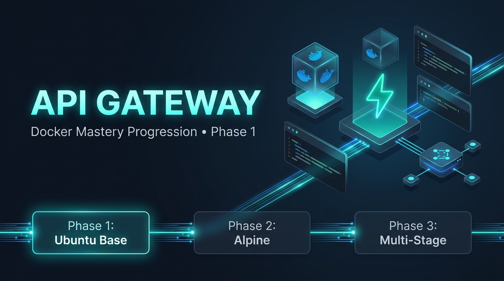
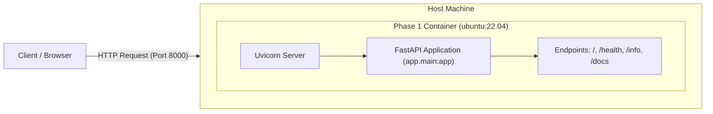

# API Gateway - Docker Progression




A FastAPI-based API Gateway service built to demonstrate the evolution of Docker containerization strategies across progressive maturity phases.

---

## 🏗️ Architecture & Container Flow



---

## 🚀 Repository Overview

This repository demonstrates the step-by-step transformation of a microservice application container from a basic setup to a production-ready containerized service.

### 📌 Roadmap & Phases

- [x] **Phase 1: Beginner Single-Stage Build**
  - Single-stage build built on top of a generic `ubuntu:22.04` base image.
  - Manual installation of Python 3 and `pip`.
  - Simple FastAPI application with `/`, `/health`, and `/info` endpoints.
- [x] **Phase 2: Optimized Base Image & Multi-Stage Builds**
  - Multi-stage build on `python:3.12-slim` base image for a lean production image footprint.
  - Separation of runtime (`requirements.txt`) and dev/test dependencies (`requirements-dev.txt`).
  - Automated testing with `pytest` + `httpx` and code linting with `flake8`.
  - GitHub Actions CI pipeline (`.github/workflows/ci.yml`) triggering lint, test, and build on push/PR.
- [ ] **Phase 3: Production Readiness & Orchestration** (Planned)
  - Docker Compose setup for API Gateway routing and dependencies.
  - Reverse proxy integration, environment variable management, and health checks.

---

## 📁 Repository Structure

```text
.
├── README.md
├── .gitignore
├── .github/
│   └── workflows/
│       └── ci.yml
├── images/
│   └── banner.png
├── phase1/
│   ├── Dockerfile
│   ├── README.md
│   ├── requirements.txt
│   ├── .dockerignore
│   └── app/
│       ├── .dockerignore
│       └── main.py
└── phase2/
    ├── Dockerfile
    ├── README.md
    ├── requirements.txt
    ├── requirements-dev.txt
    ├── test_main.py
    ├── .dockerignore
    ├── .github/
    │   └── workflows/
    │       └── ci.yml
    └── app/
        └── main.py
```

---

## 🛠️ Phase 1 Quick Start

### 1. Prerequisites

Ensure you have [Docker](https://www.docker.com/) installed and running on your machine.

### 2. Build the Docker Image

Navigate to the repository root directory and run:

```bash
docker build -t api-gateway:phase1 ./phase1
```

### 3. Run the Container

Start the API Gateway container on port `8000`:

```bash
docker run -d -p 8000:8000 --name api-gateway-phase1 api-gateway:phase1
```

### 4. Test API Endpoints

Once the container is running, access the following endpoints:

| Endpoint | Method | Description | URL |
| :--- | :--- | :--- | :--- |
| `/` | `GET` | Welcome message and phase info | [http://localhost:8000](http://localhost:8000) |
| `/health` | `GET` | Service health status and UTC timestamp | [http://localhost:8000/health](http://localhost:8000/health) |
| `/info` | `GET` | Application metadata and version | [http://localhost:8000/info](http://localhost:8000/info) |
| `/docs` | `GET` | Interactive Swagger UI API documentation | [http://localhost:8000/docs](http://localhost:8000/docs) |

### 5. Stop and Clean Up

To stop and remove the running container:

```bash
docker stop api-gateway-phase1
docker rm api-gateway-phase1
```

---

## 📝 License

This project is licensed under the MIT License.
